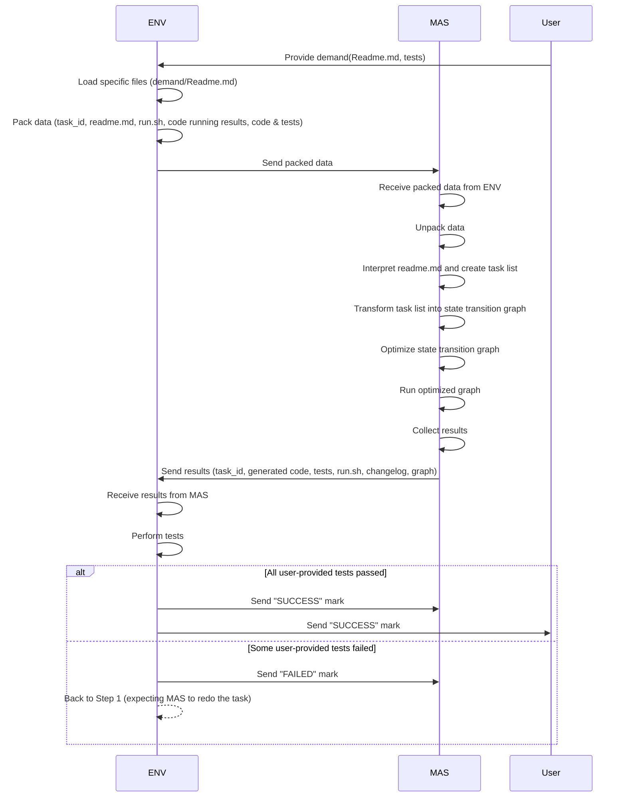

# The test_mainloop.py

All test should be include:
1. Given a mock data for each steps input and ouput, in both dataclass and json format
2. Test the varification of the format of each step's input and output is work

Example:
```python
mock_input_json = {"a": 1, "b": 2}
mock_input_dataclass = MockDataClass(a=1, b=2)
mock_output_json = {"c": 3}
mock_output_dataclass = MockDataClass(c=3)

mock_pipeline = lambda i_data: "SUCCESS" if i_data == mock_input_dataclass else "FAILED"

def test_send_through_pipeline(data: dict, pipeline) -> dict:
  # This function will be tested
    return pipeline(data)

def test_send_through_pipeline_with_json():
    assert test_send_through_pipeline(mock_input_json, mock_pipeline) == "SUCCESS"

def test_send_through_pipeline_with_dataclass():
    assert test_send_through_pipeline(mock_input_dataclass, mock_pipeline) == "SUCCESS"
```

## The loop between ENV and MAS
# TODO: @jjkysy
- Step1: ENV will send the data to MAS
- Step2: MAS will receive the data and do the task
- Step3: MAS will send the results back to ENV
- Step4: ENV will receive the results and do the test
- Step5-a: incase all user provided tests have been passed, the ENV will "SUCCESS" mark to MAS and user
- Step5-b: incase some user provided tests have been failed, the ENV will "FAILED" mark to MAS, and back to Step1 and expect the MAS to do the task again



## The ENV will do:
# @WanChengXue
- Step1: first load specific files (in this case the demand/Readme.md file) 
- Step2: then the ENV will pack the:
  - a. task_id
  - b. readme.md
  - c. run.sh
  - d. existing code running results(including pytest and cprofile results, if there is no code running results, then it will be empty)
  - e. the code itself, including bussiness logic and corresponding tests
- Step3: then the ENV will send the packed data to MAS

## The MAS(Multi-agent System) will do:
# @WangXuhongCN
- Step1: receive the packed data from ENV
- Step2: unpack the data
- Step3: It first interpretate the readme.md and understand the requirements of the task (through some LLM tools), turn it into a task list (in todo.txt style)
- Step4: The task list will then be transfer into a graph state, in which each node is a specific agent that has a specific task to do. A entry node is used to send the task list to other agents, and a exit node is used to collect the results from all agent.
- Step5: The relations of nodes in state transition graph created in Step4 will then be optimized by algorithms included in **MAS**
- Step6: The optimized graph will then be run by the MAS, and the results will be collected and sent back to ENV, including:
  - a. task_id
  - b. the generated code
  - c. the generated tests, these tests is generated by MAS to gain more understand of the code it generated
  - d. the generated run.sh
  - e. the changelog of task list
  - f. the graph of state transition